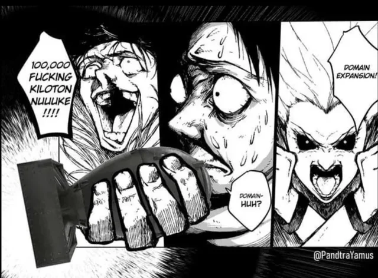

# nicola pond lobotomy_games
VIDEO --> video[https://drive.google.com/file/d/1b-5TlcbC-2aOEuwhcq2OQdwJfo8a6Cql/view?usp=sharing]
# Instrução de Execução
Pra rodar os algoritmos você tem que coloca esta pasta dentro do src do repositorio do [culling_games](https://github.com/rmnicola/culling_games) e buildar novamente -->
```bash
colcon build 
```
ou
```bash
colcon build --packages-select culling_controller
```
caso já tenha buildado o ambiente antes.


e então setar o ambiente pra rodar -->

```bash
source install/setup.bash
```
Para a execução dos comandos é necessário dois terminais com tudo buildado e os ambientes preparados. Um para rodar o jogo e outro para rodar o executavel.
## Parte 1

Pra Parte 1 é necessário rodar o comando 
```bash
ros2 run culling_controller path_follower
```
no segundo terminal

## Parte 
Pra Parte 2 é necessário rodar o comando 
```bash
ros2 run culling_controller path_finder. 
```
no segundo terminal.


bonus:


